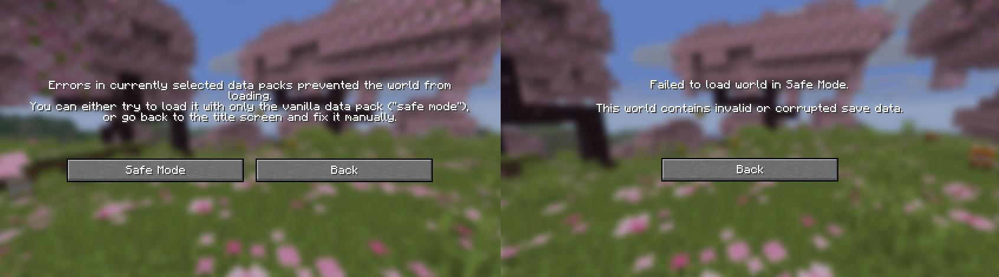
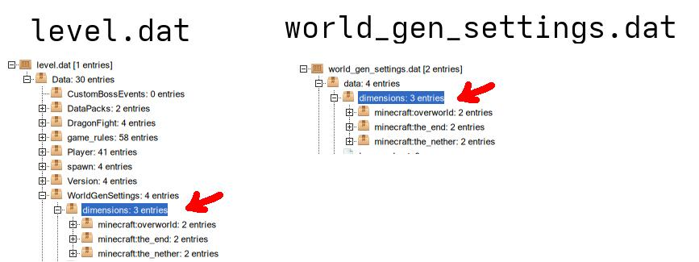
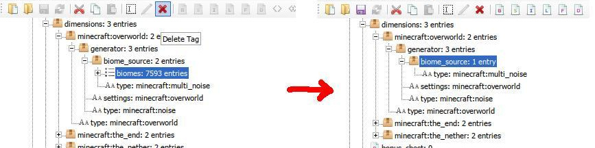
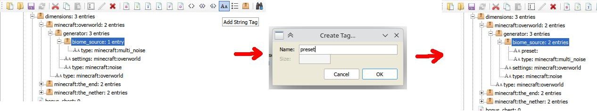
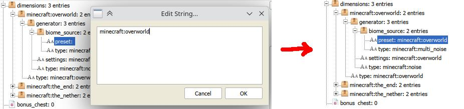
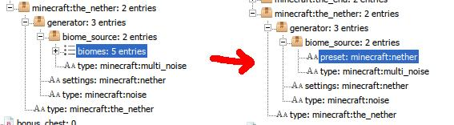
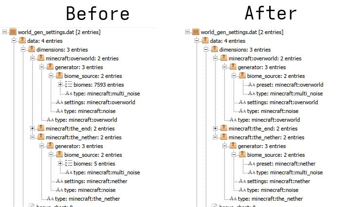

**What is this about?**  
Before 3.0, there was an oversight in how Biome Replacer modified biomes, which saved some extra data to your world. In Minecraft 26.1, this extra data will make the game believe your world is "corrupted".

  
Technical explanation

  Before 3.0, after biomes were replaced, the modified biome parameter list erroneously got saved with the world. Since it didn't cause any issues, this bug went unnoticed for years. When 26.1 released, Mojang added a 2 MB limit on NBT tags, which when reached prevents the world from loading. Since the biome list is very long, it surpassed this limit very easily. The following instructions will show how to reset it back to referencing a dimension preset again.

**Is Biome Replacer safe?**  
Any update after 3.0 is safe to use! If you never used versions of BR below that, then you have nothing to worry about.

**If you used Biome Replacer before the 3.0 update:**  
Your worlds might become "corrupted" when updating to 26.1. **This is fixable!** Continue reading to know if you're affected and what you need to do.

**Whether you need to do anything depends on the last Minecraft version you opened your world in:**  
- 26.1 and above: your world likely already refuses to open. You need to complete the instructions below to recover it.
- Between 1.19.4 and 1.21.11: Your world has been modified. If you plan to update to 26.1, you need to complete the following instructions. If you don't, you can still do them for your own peace of mind, but it's not required.
- 1.19.3 and below: you are not affected. Simply update Biome Replacer to 3.x, and your world should be safe from now on, even if you update Minecraft.

# Follow these steps to fix your world
## Update BR to (at least) 3.0
This will prevent newly created worlds from being corrupted, as well as the worlds you fix to be corrupted again after opening them. You can also remove BR completely if you don't need it anymore.

## Download NBT Explorer
Download a .zip file from the following link, extract it anywhere you like, and launch `NBTExplorer.exe`:  
https://github.com/jaquadro/NBTExplorer/releases/latest

You're free to use any other NBT editing program if you want - the steps will be similar.

## Find the corrupted file
Launch Minecraft, click on your world, then click "Edit" and "Open world folder". From there:
- For the worlds updated to 26.1 or above, you will need the file `data/minecraft/world_gen_settings.dat`
- If you're on 1.21.11 or below, you need `level.dat`

**Make a backup of this file before modifying it**. You'll thank yourself for this step if anything goes wrong!

## Fix it
1. Drag the file from the previous step into the NBT Explorer window, navigate to the `dimensions` tag and open it (this will depend on the file you have - check the picture below).
   
2. Under `minecraft:overworld` tag, navigate to `generator/biome_source`. You should see a tag that says "biomes: (some number) entries". That's what's causing the issue. Click on it to select it, then delete it using the red "X" button on the top.  
   (If you don't see the tag with such text, the world is likely not corrupted - not in a way that BR caused, anyway.)  
   
3. Select `biome_source` again and add a String tag with a "Aa" button, enter "preset" as the name and click OK. Then double click it, enter "minecraft:overworld" and press OK.  
   
   
4. Repeat steps 2 and 3 for the `minecraft:the_nether` tag, but enter `minecraft:nether` instead of `minecraft:overworld` in step 3. Yes, just "nether" without "the" - this is important!  
   
5. Skip the End - BR never replaced End biomes so it's not affected. If there aren't any custom worlds, then save your work by pressing Ctrl+S (or through File > Save), and you're done!
    - If there _are_ custom worlds, and they have the same "biomes: (some number) entries" tag inside of them, you may need to repeat steps 2 and 3 for them as well. However, I can't provide the preset name you need to use for them in step 3, as it will depend on the mod/datapack that added them. To learn what it should be, you can create a new world, drag its respective `.dat` file into the NBT Explorer, and look what it is in an uncorrupted world.

If you've done everything correctly, this is about how the file should look:  

You should now be able to join your world. If you still get the same error, try recovering your backup and trying again. If the issue persists, reach out to us here in the issues tab